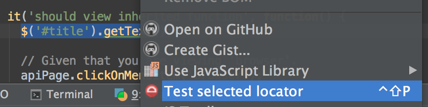
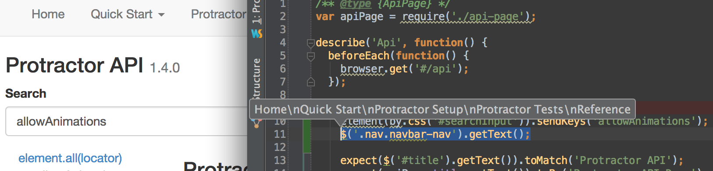

elementor-idea
==============

An intellij / webstorm plugin to test your protractor locators with
[elementor](https://github.com/andresdominguez/elementor).

## How to install it

From IntelliJ or Webstorm go to Settings (Preferences... on a mac) > Plugins >
Install plugin from disk... And select
[elementor-idea.jar](https://github.com/andresdominguez/elementor-idea/blob/master/elementor-idea.jar)

## How to use it

Start [elementor](https://github.com/andresdominguez/elementor).

Go to a protractor test file, select the text you want to run on elementor,
right-click, and Choose "Test selected locator".

See the results from your IDE

